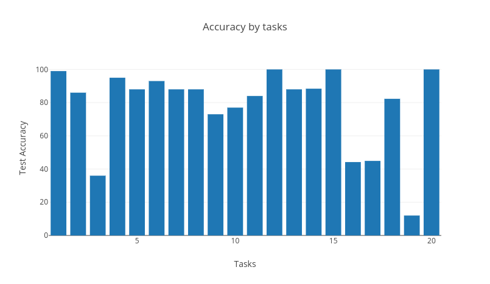

# Hindi-Question-Answering-System-using-Memn2n

Contributors:
- IIT2015074: Shubham Padia
- IIT2015075: Tushar Jandial

## Install Instructions:

1.) Make sure conda is installed, you can find a guide on how to install conda at https://conda.io/docs/user-guide/install/index.html

2.) Create a conda virtual env (We used python version 3.6.7 at the time of running the program)

```
conda create -n myenv python=3.6
```

3.) Activate your environment using `source activate myenv`

4.)
Packages to install (versions at the time of use are mentioned in the brackets):
- tensorflow (1.11.0)
- sklearn (0.20.0)

5.)
Run the programing using the below command:
```
python run.py
```
You will be asked to input a task ID, please input a task ID in the range of 1 and 20.

The project uses the open source bAbi tasks dataset. See babi QA task section at https://research.fb.com/downloads/babi/ for more details.

Following in the output of `conda list` indicating the versions of libraries installed at the time of use. Please note that installing the above two is enough to install all the below packages, this list is for reference only.
```
# Name                    Version                   Build  Channel
_tflow_select             2.3.0                       mkl  
absl-py                   0.5.0                    py36_0  
astor                     0.7.1                    py36_0  
blas                      1.0                         mkl  
ca-certificates           2018.03.07                    0  
certifi                   2018.10.15               py36_0  
gast                      0.2.0                    py36_0  
grpcio                    1.12.1           py36hdbcaa40_0  
h5py                      2.8.0            py36h989c5e5_3  
hdf5                      1.10.2               hba1933b_1  
intel-openmp              2019.0                      118  
keras-applications        1.0.6                    py36_0  
keras-preprocessing       1.0.5                    py36_0  
libedit                   3.1.20170329         h6b74fdf_2  
libffi                    3.2.1                hd88cf55_4  
libgcc-ng                 8.2.0                hdf63c60_1  
libgfortran-ng            7.3.0                hdf63c60_0  
libprotobuf               3.6.0                hdbcaa40_0  
libstdcxx-ng              8.2.0                hdf63c60_1  
markdown                  3.0.1                    py36_0  
mkl                       2019.0                      118  
mkl_fft                   1.0.6            py36h7dd41cf_0  
mkl_random                1.0.1            py36h4414c95_1  
ncurses                   6.1                  hf484d3e_0  
numpy                     1.15.3           py36h1d66e8a_0  
numpy-base                1.15.3           py36h81de0dd_0  
openssl                   1.1.1                h7b6447c_0  
pip                       10.0.1                   py36_0  
protobuf                  3.6.0            py36hf484d3e_0  
python                    3.6.7                h0371630_0  
readline                  7.0                  h7b6447c_5  
scikit-learn              0.20.0           py36h4989274_1  
scipy                     1.1.0            py36hfa4b5c9_1  
setuptools                40.4.3                   py36_0  
six                       1.11.0                   py36_1  
sqlite                    3.25.2               h7b6447c_0  
tensorboard               1.11.0           py36hf484d3e_0  
tensorflow                1.11.0          mkl_py36ha6f0bda_0  
tensorflow-base           1.11.0          mkl_py36h3c3e929_0  
termcolor                 1.1.0                    py36_1  
tk                        8.6.8                hbc83047_0  
werkzeug                  0.14.1                   py36_0  
wheel                     0.32.2                   py36_0  
xz                        5.2.4                h14c3975_4  
zlib                      1.2.11               ha838bed_2 
```

## Comprehension example:

We will input some facts in out model and then ask a question. The model must output the correct answer.
Comprehension:
- Sita seb le kar aayi.
- Priya galiyarey mein chali gayi.
- Priya sayanakaksh mein chali gayi.
- Sita galiyarey mein chali gayi.
Q: Seb ab kahan hai? 
A: Galiyara

Comprehension:
- Sita dhoodh le kar aayi.
- Mohit daftar mein gaya.
- Sita daftar mein gayi.
- Sita galiyarey mein chali gayi.
Q: Galiyarey se pehle dhoodh kahan per tha?    
A: daftar


Comprehension:
1 Mohit seb le aaya.
2 Mohit seb rakh aaya.
3 Mohit bagichey mein chala gaya.
4 Mohit galiyare mein chala gaya.
5 Mohit ke pass kitni cheezein hai?    shunya

## Results:
The results can be found in pdf form at [sem7_results.pdf](sem7_results.pdf)

## Task-wise accuracy graph:


## References
[1]
Jason Weston, Sumit Chopra & Antoine Bordes.
Memory Networks
(https://arxiv.org/pdf/1410.3916.pdf)
[2]
Jason Weston, Sumit Chopra & Antoine Bordes.
End-To-End Memory Networks
(https://arxiv.org/pdf/1503.08895.pdf)
[3]
Adrian Colyer
Memory Networks
(https://blog.acolyer.org/2016/03/10/memory-networks/)
[4]
bAbi Dataset
(https://research.fb.com/downloads/babi/)


